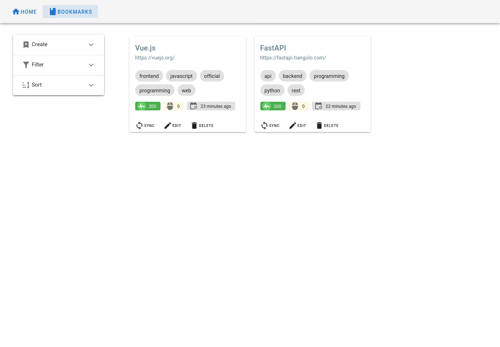

# browser-startpage

A start-up page for a web browser, which includes a clock and a simple bookmark manager.

## How to use

1. Build the web frontend: `make dist`.
2. Install the backend dependencies: `make .venv`.
3. Start the server: `bash serve.sh`.
4. Navigate to `localhost:33875` on your browser.

### With systemd

1. Edit the path in `ExecStart` in `startpage.service`.
2. Copy `startpage.service` to the systemd config directory.
3. Enable the service: `systemd --user enable startpage`.

## License

This project is licensed under the terms of the GNU Affero General Public License v3.0.

Copyright © 2020 Takao Noguchi.
